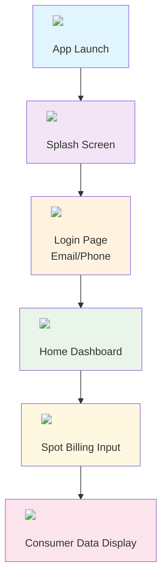

# ⚡ TPCODL Spot Billing App

<div align="center">


**A modern Android application for efficient electricity bill management and consumer data retrieval**

[](https://android-arsenal.com/api?level=24)
[](https://github.com/)
[](LICENSE)

</div>

---

## 📱 Overview

The TPCODL Spot Billing App is a comprehensive mobile solution designed for electricity billing management. Built with cutting-edge Android technologies, this app provides seamless access to consumer billing information, real-time notifications, and secure user authentication.

<div align="center">
  
  

  
</div>

---

## ✨ Features

### 🔐 **Authentication System**


- **Multi-Channel Login**: Secure login using email or phone number
- **API Integration**: Robust authentication through dedicated login API
- **User Session Management**: Persistent login state with secure token handling

### 🏠 **Home Dashboard**


- **Intuitive Interface**: Clean and user-friendly home screen
- **Quick Access**: Direct navigation to billing features
- **Real-time Updates**: Live data synchronization

### 💰 **Spot Billing Management**


- **Consumer Data Retrieval**: Fetch detailed consumer information
- **Multiple Input Methods**: Support for various billing parameters
    - Consumer Number
    - Reference Number
    - Bill Type
    - User ID
- **API-Driven**: Seamless integration with TPCODL spot billing API

### 🔔 **Push Notifications**


- **Real-time Alerts**: Instant notifications for billing updates
- **Firebase Integration**: Reliable push notification service
- **Customizable**: Tailored notification preferences

---

## 🛠️ Technology Stack

<div align="center">

### **Core Technologies**


</div>

### **Architecture & Languages**
-  **Language**: Kotlin
-  **UI Framework**: Jetpack Compose
-  **Architecture**: MVVM (Model-View-ViewModel)
-  **Database**: Room Database

### **Key Libraries & Dependencies**

#### **🎨 UI & Navigation**
```kotlin
// Jetpack Compose
implementation(platform(libs.androidx.compose.bom))
implementation(libs.androidx.material3)        // Material Design 3
implementation(libs.androidx.ui)               // Core UI components

// Navigation
implementation("androidx.navigation:navigation-compose:2.7.7")
```

#### **🌐 Networking**
```kotlin
// HTTP Client - Retrofit & OkHttp
implementation("com.squareup.retrofit2:retrofit:2.9.0")
implementation("com.squareup.retrofit2:converter-gson:2.9.0")
implementation("com.squareup.okhttp3:logging-interceptor:4.12.0")
```

#### **🗄️ Database**
```kotlin
// Room Database
implementation("androidx.room:room-runtime:2.6.1")
implementation("androidx.room:room-ktx:2.6.1")
kapt("androidx.room:room-compiler:2.6.1")
```

#### **🔥 Firebase Services**
```kotlin
// Firebase Platform
implementation(platform("com.google.firebase:firebase-bom:33.14.0"))
implementation("com.google.firebase:firebase-analytics")
implementation("com.google.firebase:firebase-messaging:23.4.0")
```

#### **💾 Data Management**
```kotlin
// Data Storage & Serialization
implementation("androidx.datastore:datastore-preferences:1.0.0")
implementation("com.google.code.gson:gson:2.10.1")
```

---

## 📋 Requirements

<div align="center">


</div>

### **System Requirements**
-  **Minimum SDK**: Android 7.0 (API level 24)
-  **Target SDK**: Android 15 (API level 35) 
-  **Compile SDK**: Android 15 (API level 35)

### **Development Environment**
-  **Android Studio**: Arctic Fox or later
-  **Kotlin**: 1.9.0+
-  **Java**: Version 11
-  **Gradle**: 8.0+

---

## 🚀 Getting Started

### **Prerequisites**


1.  Android Studio installed
2.  Firebase project setup
3.  TPCODL API access credentials

### **Installation Steps**

1. **🔄 Clone the Repository**
   ```bash
   git clone [repository-url]
   cd tpcodl-spot-billing
   ```

2. **🔥 Firebase Configuration**
   ```bash
   # Add google-services.json to the app/ directory
   # Configure Firebase Analytics and Messaging
   ```

3. **⚙️ API Configuration**
   ```bash
   # Update API endpoints in the configuration files
   # Add authentication credentials
   ```

4. **🔨 Build the Project**
   ```bash
   ./gradlew build
   ```

5. **▶️ Run the Application**
   ```bash
   ./gradlew installDebug
   ```

---

## 📱 App Flow

<div align="center">



</div>

---

## 🏗️ Architecture

<div align="center">
  
</div>

The app follows **MVVM (Model-View-ViewModel)** architecture pattern:

- **📊 Model**: Data layer with Room database and API services
- **🎨 View**: UI layer built with Jetpack Compose
- **🔄 ViewModel**: Business logic and state management

---

## 🔧 Configuration

### **🌐 API Integration**
-  **Login API**: User authentication service
-  **Spot Billing API**: Consumer data retrieval service

### **🗄️ Database Schema**
-  User session data
-  Consumer information cache
-  Billing history

### **🔔 Notification Setup**
-  Firebase Cloud Messaging configuration
-  Custom notification channels
-  Background service integration

---

## 🧪 Testing

<div align="center">


</div>

The app includes comprehensive testing:

```kotlin
// Unit Tests
testImplementation("junit:junit:4.13.2")

// Android Instrumentation Tests  
androidTestImplementation("androidx.test.ext:junit:1.1.5")
androidTestImplementation("androidx.test.espresso:espresso-core:3.5.1")

// Jetpack Compose Tests
androidTestImplementation("androidx.compose.ui:ui-test-junit4")
```

---

## 📦 Build Configuration

<div align="center">


</div>

- **📱 Application ID**: `com.example.kotlincourse`
- **🔢 Version Code**: 1
- **📝 Version Name**: 1.0
- **🔨 Build Tools**: Android Gradle Plugin 8.0+

---

## 🔒 Security Features

<div align="center">
  
</div>

-  Secure API communication with HTTPS
-  Token-based authentication
-  Data encryption for sensitive information
-  Secure local storage using DataStore

---

## 🚀 Performance Optimizations

<div align="center">
  
</div>

- **🎨 Efficient UI**: Jetpack Compose for smooth animations
- **🌐 Network Optimization**: Retrofit with OkHttp interceptors
- **🗄️ Database Optimization**: Room with coroutines support
- **🧠 Memory Management**: Lifecycle-aware components

---

## 📞 Support & Contact

<div align="center">


For technical support or inquiries related to the TPCODL Spot Billing App, please contact the development team.

</div>

---

## 📄 License

<div align="center">


This project is proprietary software developed for TPCODL.

</div>

---

<div align="center">

**Built with ❤️ for TPCODL**

*Empowering efficient electricity billing management through innovative mobile technology*


---


</div>